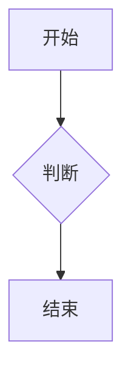

这里开始写正文内容。
# Markdown 简明使用表

## 在线编辑器网址

| 功能 | 按键 / 格式 |
|------|-------------|
| 在线 Markdown 编辑器 | https://markdown.com.cn/editor/ |

---

## 基础文本格式

| 功能 | 按键 / 格式 |
|------|-------------|
| 一级标题 | `# 标题` |
| 二级标题 | `## 标题` |
| 三级标题 | `### 标题` |
| 粗体 | `**文字**` |
| 斜体 | `*文字*` |
| 删除线 | `~~文字~~` |
| 高亮 | `==文字==` |
| 行内代码 | `` `代码` `` |
| 引用 | `> 引用内容` |
| 分割线 | `---` |

---

## 链接与图片

| 功能 | 按键 / 格式 |
|------|-------------|
| 链接 | `[显示文字](网址)` |
| 图片 | `` |
| 页面跳转锚点 | `<a id="jump_8"></a>` |

示例：

```markdown
[Markdown 教程](https://markdown.com.cn/editor/)


```

---

## 列表

| 功能 | 按键 / 格式 |
|------|-------------|
| 无序列表 | `- 内容` |
| 二级无序列表 | 在 `-` 前加两个空格 |
| 有序列表 | `1. 内容` |
| 任务列表：已完成 | `- [x] 内容` |
| 任务列表：未完成 | `- [ ] 内容` |

示例：

```markdown
- 无序列表
  - 二级列表

1. 有序列表
2. 有序列表

- [x] 已完成
- [ ] 未完成
```

---

## 代码块

| 功能 | 按键 / 格式 |
|------|-------------|
| 普通代码块 | 使用三个反引号包裹 |
| 指定语言代码块 | ` ```javascript ` |

示例：

```javascript
function hello() {
  console.log('Hello, Markdown!');
}
```

---

## 表格

| 功能 | 按键 / 格式 |
|------|-------------|
| 表格 | 使用 `|` 分隔列 |
| 表头分隔线 | 使用 `---` |

示例：

```markdown
| 功能 | 状态 |
|------|------|
| 实时预览 | 支持 |
| 自动保存 | 支持 |
```

---

## 数学公式

| 功能 | 按键 / 格式 |
|------|-------------|
| 行内公式 | `$E = mc^2$` |
| 块级公式 | `$$ 公式内容 $$` |

示例：

```markdown
行内公式：$E = mc^2$

块级公式：

$$
\int_a^b f(x)\,dx = F(b) - F(a)
$$
```

---

## Mermaid 图表

| 功能 | 按键 / 格式 |
|------|-------------|
| Mermaid 图表 | 使用 ` ```mermaid ` 代码块 |

示例：



---

## 目录与脚注

| 功能 | 按键 / 格式 |
|------|-------------|
| 自动目录 | `[TOC]` |
| 脚注引用 | `[^1]` |
| 脚注内容 | `[^1]: 脚注内容` |

示例：

```markdown
这里有一个脚注[^1]。

[^1]: 这是脚注内容。
```

---

## Callout 提示框

| 功能 | 按键 / 格式 |
|------|-------------|
| 信息提示 | `> [!INFO]` |
| 警告提示 | `> [!WARNING]` |

示例：

```markdown
> [!INFO]
> 这是一个信息提示框。

> [!WARNING]
> 这是一个警告提示框。
```

---

## 常用快捷键

| 功能 | 按键 / 格式 |
|------|-------------|
| 粗体 | `Ctrl + B` |
| 斜体 | `Ctrl + I` |
| 插入链接 | `Ctrl + K` |
| 手动保存 | `Ctrl + S` |
| 注释 | `Ctrl + /` |